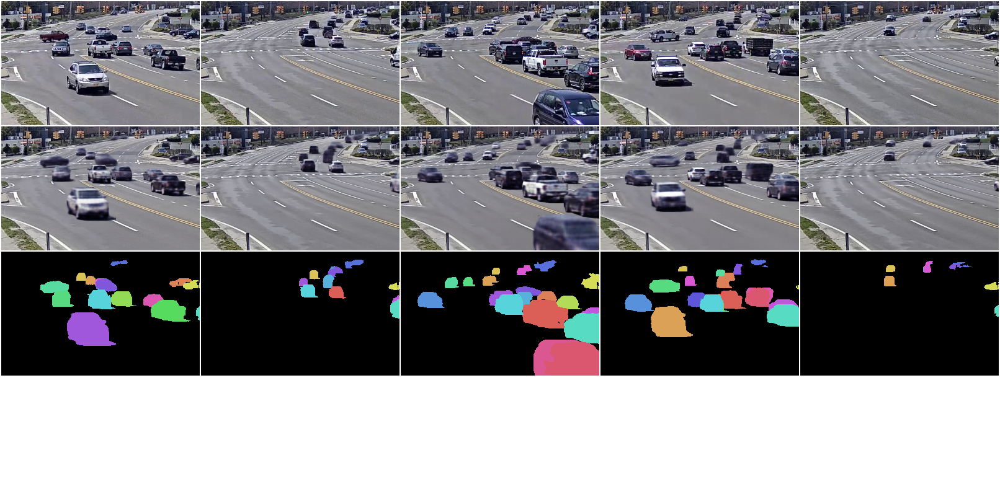
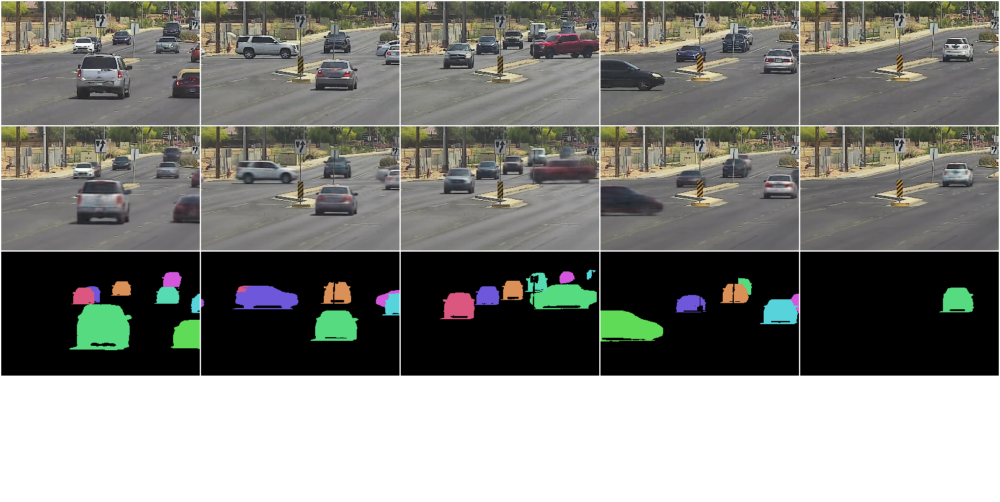
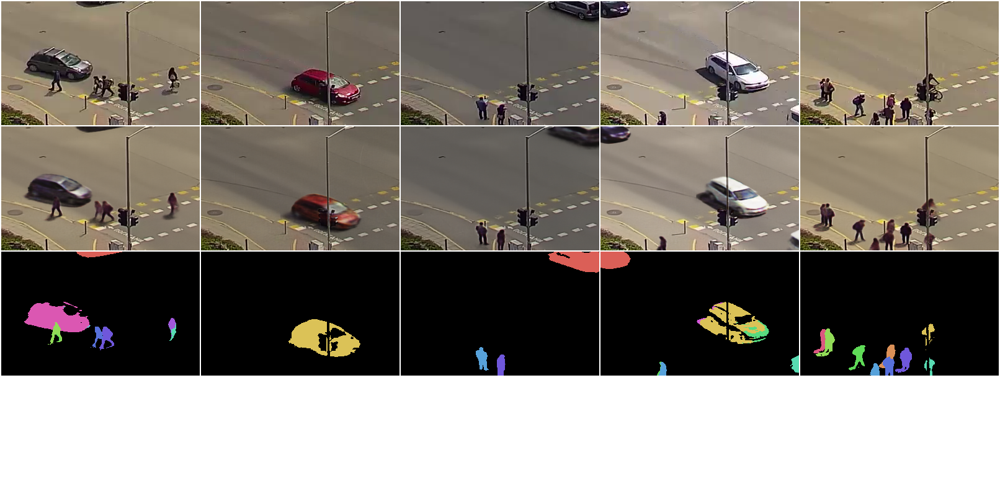

# AST Model - Unsupervised Multi-object Segmentation Using Attention and Soft-argmax

Official implementation of the model AST described in the version 1 of the paper "
Unsupervised Multi-object Segmentation Using Attention and Soft-argmax"

Update for version 2 of the paper to be realeased soon.





## Requirements

The model needs Pytorch (>= 1.7.1) and Torchvision with cuda capability (see https://pytorch.org/ )

The model also needs OpenCV (>=4.1) (see https://opencv.org/ )


To install other requirements:

```setup
pip install -r requirements.txt
```
The model has been tested on Nvidia RTX 3090 GPU.


## How to use the model


Four steps are required to get foreground segmentation masks samples: 

- train the background model
- generate the background dataset using the trained background model
- train the foreground model
- apply the trained foreground model to get segmentation masks

### Step 1 : train the background model

- go to the background directory and create a new entry in the background configuration file config.py with the path to the images dataset,the size of the images, 
  the required number of iterations and a path the backgroudn model output directory.
The number of iterations should be 
  
    - 2500 if the sequence shows a fixed background without any illumination changes
    - 10 000 for a video sequence taken from a fixed camera with some illumination changes
    - 24 000 iterations and at least 20 epochs for a video taken from a moving camera
    - 500 000 for non video synthetic datasets with dynamic backgrounds such as ObjectsRoom, CLEVRTEX or Shapestacks
    
- start training with the command python train.py.
  During training, some image samples are generated and saved using the path 
  training_images_output_directory indicated in the configuration file

Specific instructions to handle objectsroom, CLEVR, CLEVRTEX and Shapestacks datasets are provided in the dataset.py, 
create_clevr_data.py and create_objects_rooom.py files

### Step 2 : generate the background dataset

- update the background configuration file with the path to the final background checkpoint which can be found in  the background model output directory
- start to generate the background dataset with the command python generate_background_dataset.py.
This command will create the following datasets in the background model output directory :
     - background image datasets (RGB)
    - background image with error prediction dataset (RGBA)
    - copy of the input image dataset as a frame sequence ( with the same ordering as the background images)
    - copy of ground-truth segmentation masks if available in the input dataset
    - background/foreground segmentation masks predicted by the background model

### Step 3 : train the foreground model

  - create a new entry in the foreground configuration file MF_config.py, with the image sizes, value of K, 
  and paths to the required datasets in the background model output directory
  - choose feature map generator and update configuration file accordingly. Implemented generators are Unet (default) and Segformer (Hugging Face implementation). 
  - start training the foreground model with python MF_train.py
    during training, some image samples are generated and using the path training_images_output_directory 
    set in the configuration file MF_config.py which have to be updated. 
    

### Step 4 : apply the trained foreground model to get segmentation masks

- update the foreground configuration file with the path to the trained model
- generate samples using the command python MF_generate_image_samples.py


